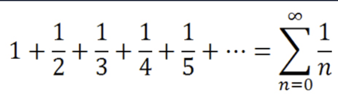
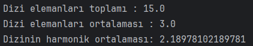

# Dizideki Elemanların Ortalamasını Hesaplayan Program

Dizideki sayıların ortalamasını hesaplayan programı yazınız.

Dizideki sayıların harmonik ortalamasını hesaplayan programı yazınız.

Harmonik Ortalama formülü : n (eleman sayısı) / elemanların harmonik serisi

Harmonik Seri Formülü :

## Çözüm

