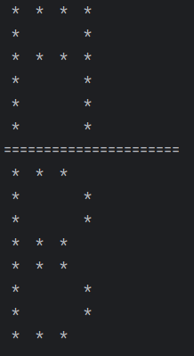

# Çok Boyutlu Diziler ile Harf Yazdıran Program

Çok boyutlu diziler kullanılarak "yıldızlar" ile ekrana "A" harfi yazan programı yazınız.

Çok boyutlu diziler kullanılarak "yıldızlar" ile ekrana "B" harfi yazan programı yazınız.

## Çözüm

