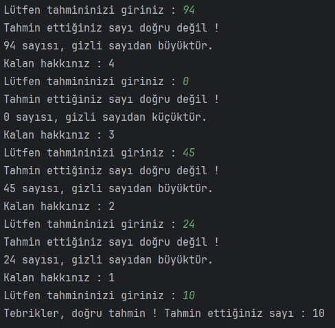
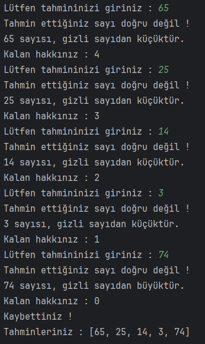
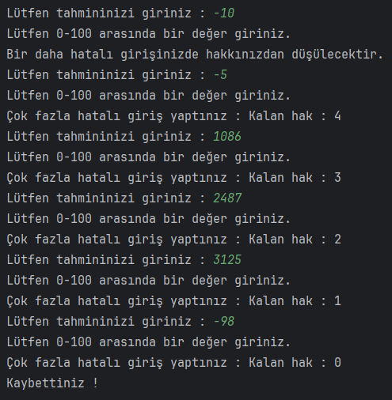

# Sayı Tahmin Oyunu

Java dilinde programın 0-100 arasında rastgele seçtiği bir sayıyı kullanıcının tahmin etmesini istediğimiz bir "Sayı Tahmin Oyunu" yapıyoruz.

## Çözüm

Kazanma:

Kaybetme:

Yanlış giriş:

