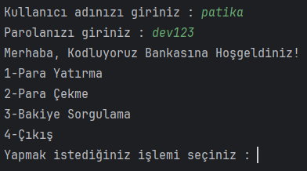
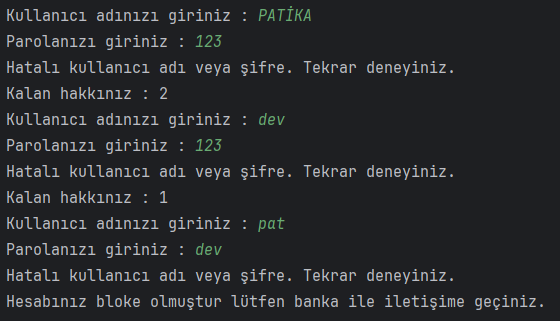
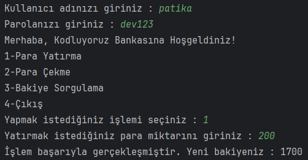
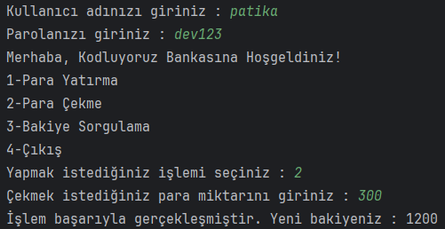
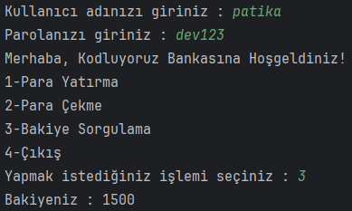
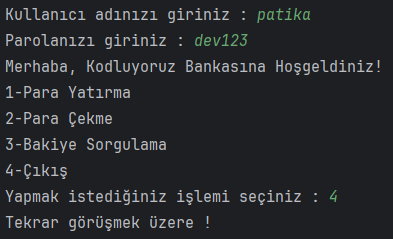

# ATM Projesi
Java döngüler ile kullanıcının banka hesabını yönetebildiği bir ATM projesi yapıyoruz.

Aynı projedeki ATM işlemlerini "Switch-Case" kullanarak yapınız.

## Çözüm

Başarılı Giriş:

Hatalı Giriş:

Para Yatırma:

Para Çekme:

Bakiye Sorgulama:

Çıkış:

