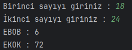
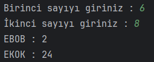
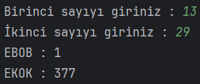

# EBOB-EKOK Bulan Program

Java ile iki sayının EBOB ve EKOK değerlerini bulan program yazıyoruz.

EBOB : İki ya da daha fazla doğal sayının ortak bölenlerinin en büyüğüne bu sayıların en büyük ortak böleni, kısaca EBOB‘u denir.

ÖRNEK: 18 ve 24 sayılarının en büyük ortak bölenini adım adım bulalım.

18’in bölenleri : 1, 2, 3, 6, 9, 18

24’ün bölenleri : 1, 2, 3, 4, 6, 8, 12, 24

Bu ortak bölenlerin en büyüğü 6 sayısı EBOB’tur.

EKOK : İki ya da daha fazla doğal sayının ortak katlarının en küçüğüne bu sayıların en küçük ortak katı, kısaca EKOK‘u denir.

ÖRNEK: 6 ve 8 sayılarının en küçük ortak katını adım adım bulalım.

6’nın katları : 6, 12, 18, 24, 30, 36, 42, 48, …

8’in katları : 8, 16, 24, 32, 40, 48, 56, 64, …

Bu ortak katlardan en küçüğü 24 sayısı EKOK’tur.

EKOK = (n1*n2) / EBOB

Java ile iki sayının EBOB ve EKOK değerlerini "While Döngüsü" kullanarak yazınız.

## Çözüm

----

----

