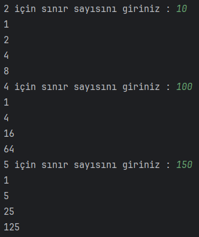

# Girilen Sayıdan Küçük 2, 4 ve 5'in Kuvvetlerini Bulan Program
Java döngüler ile girilen sayıya kadar olan 2'nin kuvvetlerini ekrana yazdıran programı yazıyoruz.

Ödev
Java döngüler ile girilen sayıya kadar olan 4 ve 5'in kuvvetlerini ekrana yazdıran programı yazıyoruz.

## Çözüm

