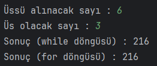

# Üslü Sayı Hesaplayan Program

Java ile kullanıcının girdiği değerler ile üslü sayı hesaplayan programı yazıyoruz.

Java ile kullanıcının girdiği değerler ile üslü sayı hesaplayan programı "For Döngüsü" kullanarak yapınız.

## Çözüm

