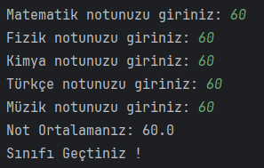
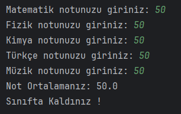
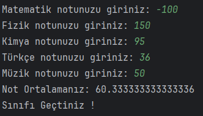

# Sınıfı Geçme Durumu
Dersler : Matematik, Fizik, Türkçe, Kimya, Müzik

Geçme Notu : 55

Eğer girilen ders notları 0 veya 100 arasında değil ise ortalamaya katılmasın.

## Çözüm

Sınıfı geçme:

Sınıfta kalma:

0-100 arasında olmayan dersler için ortalama:

