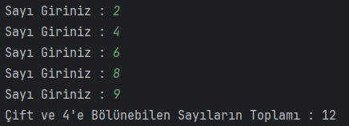
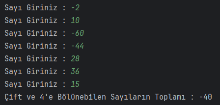

# Tek Sayıların Toplamını Program
Java döngüler ile negatif bir değer girilene kadar kullanıcıdan girişleri kabul eden ve girilen değerlerden tek sayıları toplayıp ekrana basan programı yazıyoruz.

Java döngüler ile tek bir sayı girilene kadar kullanıcıdan girişleri kabul eden ve girilen değerlerden çift ve 4'ün katları olan sayıları toplayıp ekrana basan programı yazıyoruz.

## Çözüm

