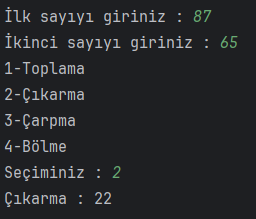
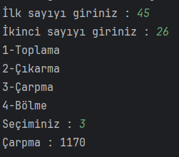
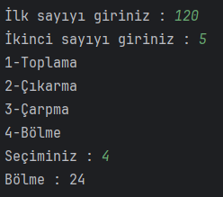
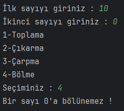
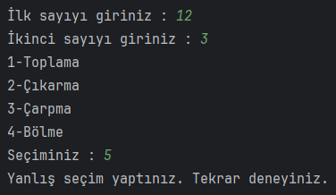

# Hesap Makinesi Programı

Switch-Case yapısı kullanılarak hesap makinesi programı yapıldı.

## Çözüm

| Toplama:    | Çıkarma: |
| ----------- | ----------- |
| | |

| Çarpma:   | Bölme:        |
| ----------- | ----------- |
|||

| 0'a Bölme:  | Geçersiz Seçim:    |
| ----------- | ----------- |
|||
