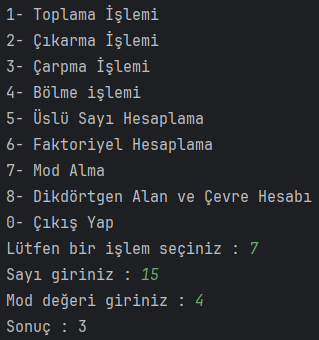
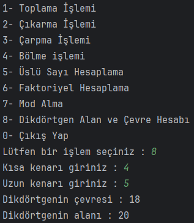

# Gelişmiş Hesap Makinesi

Gelişmiş Hesap Makinesi
Java ile kullanıcın seçtiği işlemleri yapan hesap makinesi yapıyoruz.

Hesap makinesinin fonksiyonları :


```java
1- Toplama İşlemi
2- Çıkarma İşlemi
3- Çarpma İşlemi
4- Bölme işlemi
5- Üslü Sayı Hesaplama
6- Faktoriyel Hesaplama
7- Mod Alma
8- Dikdörtgen Alan ve Çevre Hesabı
```
Aynı projeye mod almak ve dikdörtgen alan çevre hesabını yapan metotları yazıp menüde işlevsel hale getiriniz.

## Çözüm

Mod alma:



Dikdörtgen alan ve çevre hesabı:




