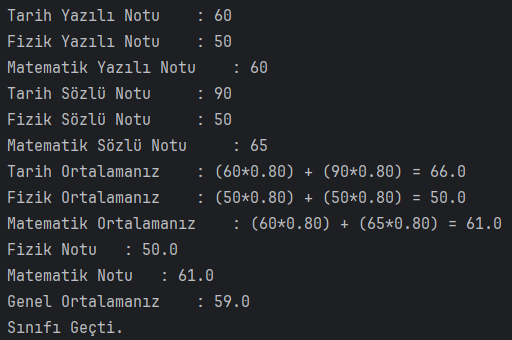

# Recursive Metotlar ile Üslü Sayı Hesaplama

Java dilinde, taban ve üs değerleri kullanıcıdan alınan üs alma işlemini "Recursive" metot kullanarak yapan programı yazınız.

Senaryo

```
Taban değeri giriniz :2
Üs değerini giriniz : 0
Sonuç : 1
Taban değeri giriniz : 2
Üs değerini giriniz : 3
Sonuç : 8
Taban değeri giriniz : 5
Üs değerini giriniz : 3
Sonuç : 125
```

## Çözüm

Sınıfı geçme:


Sınıfta kalma:


Genel not ortalaması:

